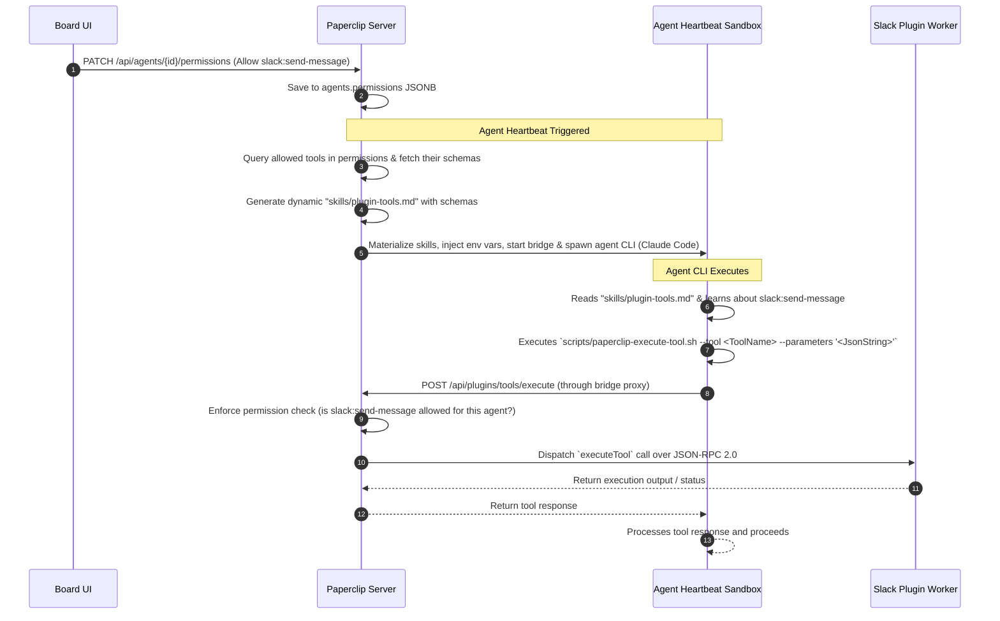

# 2026-05-23-plugin-tool-registry-integration

An architectural design and implementation plan for exposing dynamic plugin-contributed tools to heartbeating Paperclip agents (such as Claude Code / opencode) with granular, per-agent-per-tool permissions.

---

## 1. Executive Summary

### Background: Two Distinct Tool Sets

When a Paperclip agent runs, it already receives a **static** rulebook — `skills/paperclip/SKILL.md` — that describes the core Paperclip REST API (issue checkout, task updates, budget queries, etc.). This file is baked into the repository and is the same for every agent at every company.

Plugin-contributed tools (e.g., `slack:send-message`, `linear:create-issue`) are **fundamentally different**:
- They are **dynamic**: they only exist once a plugin package is installed and has registered its tools with the `PluginToolRegistry` at runtime.
- They are **company-scoped**: different companies will have different plugins active, so there is no single static list that can be pre-written.
- Their **schemas come from the plugin package itself** and are unknown to the core server at build time.

Because of this, plugin tools cannot simply be added to the static `SKILL.md`. Instead, the server must **auto-generate** a `plugin-tools.md` file at agent spawn time by querying the live `PluginToolDispatcher` for that company's allowed tools. The agent reads this generated file the same way it reads `SKILL.md` — it is never manually written or maintained.

---

Paperclip V1 features a robust **Plugin Tool Registry** and **Plugin Tool Dispatcher** that registers tools contributed by active plugins (e.g., the Slack or Linear plugin) and exposes a `POST /api/plugins/tools/execute` endpoint for executing them.

However, agents running in the heartbeat cycle cannot currently access or call these plugin tools. There are two blocking problems:

1. **Authorization Hard Block (`assertBoard`)**: `POST /api/plugins/tools/execute` currently calls `assertBoardOrgAccess(req)`, which throws a `403 Forbidden` for any request authenticated with an agent API key. Even if an agent knows about a tool, any attempt to call it is rejected at the authorization layer.
2. **No Tool Discovery**: There is no mechanism to materialize dynamic plugin tool schemas into the agent's context. The static `skills/paperclip/SKILL.md` only covers core Paperclip APIs; plugin tools are invisible to the agent at spawn time.
3. **No Shell Execution Wrapper**: There is no lightweight CLI script in the execution workspace for the agent to invoke `POST /api/plugins/tools/execute` with its own API key and run context.

This design resolves all three blockers: it opens the authorization gate for agent actors on a per-tool basis, auto-generates a `plugin-tools.md` file at spawn time so agents can discover their allowed tools, and provides a shell wrapper for execution.

---

## 2. Dynamic Tool Calling Lifecycle

The following sequence diagram outlines how the agent discovers and executes a plugin tool (e.g., `slack:send-message`) under the proposed architecture:  



---

## 3. Required Code Changes (Component Breakdown)

To implement this design, changes will be distributed across the database, shared validators, server services/routes, and the frontend board UI.

---

### Component A: Database & Shared Layer

We will use the existing `permissions` column of the `agents` table (which is a flexible `jsonb` column) to store the allowed plugin tools map. This ensures zero database schema alterations or migrations are required, preserving stability.

#### 1. Shared Validators: `packages/shared/src/validators/agent.ts`
We need to extend the `agentPermissionsSchema` and `updateAgentPermissionsSchema` to support a new field `allowedPluginTools`, which maps namespaced tool names to a boolean toggle.

```typescript
// Modify packages/shared/src/validators/agent.ts

export const agentPermissionsSchema = z.object({
  canCreateAgents: z.boolean().optional().default(false),
  canAssignTasks: z.boolean().optional().default(false),
  // Map of namespaced tool names -> allowed state (e.g., { "slack:send-message": true })
  allowedPluginTools: z.record(z.boolean()).optional().default({}),
});

export const updateAgentPermissionsSchema = z.object({
  canCreateAgents: z.boolean(),
  canAssignTasks: z.boolean(),
  allowedPluginTools: z.record(z.boolean()).optional(),
});
```

---

### Component B: Server Orchestration & Runtime

#### 1. Dynamic Skill Materialization: `packages/adapters/claude-local/src/server/prompt-cache.ts`
When building the ephemeral prompt bundle folder (`addDir`) passed to Claude Code via `--add-dir`, we will dynamically generate a markdown skill file that lists all allowed tools.

```typescript
// In packages/adapters/claude-local/src/server/prompt-cache.ts
// Inside prepareClaudePromptBundle():

// 1. Fetch allowed tools from the agent's permissions
const agentPermissions = agent.permissions as Record<string, any>;
const allowedMap = agentPermissions?.allowedPluginTools ?? {};
const allowedToolNames = Object.keys(allowedMap).filter(key => allowedMap[key] === true);

// 2. Query the PluginToolDispatcher for allowed tool metadata
const dynamicToolsMarkdown = [];
if (allowedToolNames.length > 0) {
  dynamicToolsMarkdown.push(
    "---",
    "name: plugin-tools",
    "description: Executable third-party integration tools assigned to you.",
    "---",
    "# Active Plugin Tools",
    "",
    "You have explicit authorization to call the following tools. To call any of these tools,",
    "execute the shell wrapper in the workspace:",
    "```bash",
    "scripts/paperclip-execute-tool.sh --tool <ToolName> --parameters '<JsonString>'"
    "```",
    ""
  );

  for (const namespacedName of allowedToolNames) {
    const tool = toolDispatcher.getTool(namespacedName);
    if (!tool) continue;

    dynamicToolsMarkdown.push(
      `## Tool: ${tool.namespacedName}`,
      `**Description**: ${tool.description}`,
      "**Parameter Schema (JSON)**:",
      "```json",
      JSON.stringify(tool.parametersSchema, null, 2),
      "```",
      ""
    );
  }

  // 3. Write "plugin-tools.md" into the skillsHome directory
  const pluginToolsFilePath = path.join(skillsHome, "plugin-tools.md");
  await fs.writeFile(pluginToolsFilePath, dynamicToolsMarkdown.join("
"), "utf8");
}
```

#### 2. Shell Execution Wrapper: `scripts/paperclip-execute-tool.sh`
A lightweight shell wrapper placed in the repository that handles authentication headers, formatting, and executing POST requests to the callback bridge API.

```bash
#!/usr/bin/env bash
# scripts/paperclip-execute-tool.sh

# Fail fast
set -eo pipefail

# Parse args
while [[ "$#" -gt 0 ]]; do
    case $1 in
        --tool) TOOL="$2"; shift ;;
        --parameters) PARAMS="$2"; shift ;;
        *) echo "Unknown parameter: $1"; exit 1 ;;
    esac
    shift
done

if [ -z "$TOOL" ] || [ -z "$PARAMS" ]; then
    echo "Usage: $0 --tool <NamespacedName> --parameters '<JsonString>'"
    exit 1
fi

# Assert Paperclip env vars are present
if [ -z "$PAPERCLIP_API_URL" ] || [ -z "$PAPERCLIP_API_KEY" ] || [ -z "$PAPERCLIP_RUN_ID" ] || [ -z "$PAPERCLIP_AGENT_ID" ] || [ -z "$PAPERCLIP_COMPANY_ID" ]; then
    echo "Error: Incomplete Paperclip environment variables."
    exit 1
fi

# Resolve projectId from execution context or fallback
PROJECT_ID="${PAPERCLIP_PROJECT_ID:-$PAPERCLIP_WORKSPACE_ID}"

# Perform call via curl through bridge proxy
curl -s -X POST "$PAPERCLIP_API_URL/api/plugins/tools/execute" 
  -H "Authorization: Bearer $PAPERCLIP_API_KEY" 
  -H "X-Paperclip-Run-Id: $PAPERCLIP_RUN_ID" 
  -H "Content-Type: application/json" 
  -d $(jq -n 
    --arg tool "$TOOL" 
    --argjson params "$PARAMS" 
    --arg agentId "$PAPERCLIP_AGENT_ID" 
    --arg runId "$PAPERCLIP_RUN_ID" 
    --arg companyId "$PAPERCLIP_COMPANY_ID" 
    --arg projectId "$PROJECT_ID" 
    '{
      tool: $tool,
      parameters: $params,
      runContext: {
        agentId: $agentId,
        runId: $runId,
        companyId: $companyId,
        projectId: $projectId
      }
    }')
```

#### 3. Request Security Enforcement: `server/src/routes/plugins.ts`
We enforce verification inside the `POST /api/plugins/tools/execute` endpoint to prevent agents from bypass attempts:

```typescript
// In server/src/routes/plugins.ts
// Inside router.post("/plugins/tools/execute"):

// 1. Look up the executing agent
const agent = await db
  .select({ permissions: agentsTable.permissions })
  .from(agentsTable)
  .where(eq(agentsTable.id, runContext.agentId))
  .limit(1)
  .then(rows => rows[0] ?? null);

if (!agent) {
  res.status(403).json({ error: "Agent not found" });
  return;
}

// 2. Validate tool execution permissions
const allowedPluginTools = (agent.permissions as any)?.allowedPluginTools ?? {};
if (allowedPluginTools[tool] !== true) {
  res.status(403).json({
    error: `Access Denied: Agent does not have permission to execute tool "${tool}".`
  });
  return;
  }
```

---

### Component C: Frontend Board UI

#### 1. React Detail Tab: `ui/src/pages/AgentDetail.tsx`
We will add a new configuration section in the Agent Detail page under a **"Permissions & Integration Tools"** card.
- **Data Loading**: Fetches the list of all dynamic tools from `GET /api/plugins/tools` and groups them by their parent plugin (using their `pluginId` / `pluginDbId`).
- **Interactive Toggles**: Renders each tool along with its description, displaying a switch toggle backed by `permissions.allowedPluginTools[toolName]`. 
- **Saving State**: When toggled, posts the updated permissions object to `POST /api/agents/:id/permissions` or `PATCH /api/agents/:id`.

Example design wireframe for the new UI component:

```
+----------------------------------------------------------------------+
| [Card] PLUGIN CONTRIB TOOLS & PERMISSIONS                           |
+----------------------------------------------------------------------+
| Toggle access to external plugin-contributed capabilities.          |
|                                                                      |
|  [Group] Slack Integration                                           |
|  [x] slack:send-message                                              |
|      Allow agent to post comments or notifications in Slack channels |
|  [ ] slack:get-channel-history                                       |
|      Allow agent to read conversation feeds                          |
|                                                                      |
|  [Group] Linear Integration                                          |
|  [x] linear:create-issue                                             |
|      Allow agent to open Linear tickets matching work status         |
|                                                                      |
|                                                     [ Save Changes ] |
+----------------------------------------------------------------------+
```

---

## 4. Verification Plan

To verify this implementation once developed, the following flows will be checked:

### 1. Backend Unit & Integration Tests
* Write an integration test in `server/src/__tests__/plugin-tool-permissions.test.ts` that:
  - Registers a fake plugin tool `test:say-hello`.
  - Creates an agent with `allowedPluginTools: { "test:say-hello": true }`.
  - Asserts that invoking `POST /api/plugins/tools/execute` succeeds.
  - Revokes permissions (`allowedPluginTools: { "test:say-hello": false }`).
  - Asserts that invoking the endpoint returns `403 Forbidden`.

### 2. Prompt Cache Materialization Verification
* Create an agent, activate a plugin tool, and wake the agent.
* Inspect the materialized `claude-prompt-cache` directory under `data/companies/{companyId}/claude-prompt-cache/{bundleId}/.claude/skills/`.
* Verify that `plugin-tools.md` exists and contains correct tool names and schemas.

### 3. End-to-End Slack Tool Execution
* Grant permission to the slack plugin tool.
* Trigger a heartbeat on an issue.
* Verify that the agent successfully runs the `scripts/paperclip-execute-tool.sh` script, calls the Slack plugin, and posts the message successfully, recording the execution trace in the heartbeat log.
